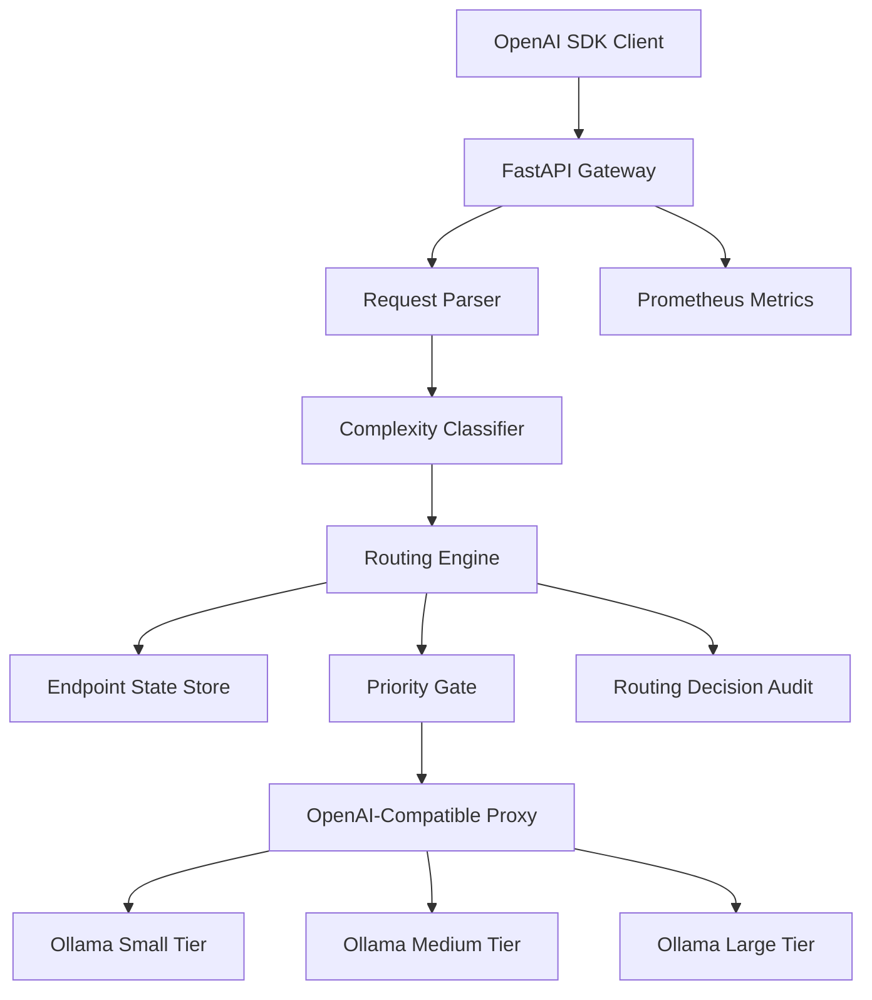

# inference-arbiter v1 Implementation Plan

## Mission
Build a working, benchmarkable v1 of `inference-arbiter`: an OpenAI-compatible inference gateway that accepts `POST /v1/chat/completions`, classifies request complexity, chooses an appropriate local Ollama model tier, enforces basic SLO and priority behavior, proxies streaming and non-streaming responses, and exposes enough telemetry to explain every routing decision.

This keeps the project's central contribution focused: not another model server, but a routing control plane in front of OpenAI-compatible model servers.

## Confirmed v1 Scope
- Backend target: Ollama-first local demo for Apple Silicon, using the same OpenAI-compatible `/v1/chat/completions` contract that vLLM supports.
- Classifier target: heuristic classifier plus an optional lightweight model interface hook, with no training pipeline in v1.
- API target: OpenAI chat completions compatibility for normal SDK usage, plus project-specific optional routing fields.
- Observability target: structured logs, Prometheus metrics, and an audit endpoint for routing decisions.
- Benchmark target: enough Locust/load-test support to compare baseline routing against inference-arbiter routing.

## Recommended Spec Refinements
Update [`SPEC.md`](SPEC.md) so it becomes an implementation-grade v1 spec rather than a broad concept note.

Key edits:
- Fix typos and formatting issues, including `virutal` -> `virtual` and malformed `json{` blocks.
- Split ideas into `v1`, `post-v1`, and `research extensions` so v1 does not sprawl.
- Make Ollama the v1 runtime default, while explicitly preserving the vLLM-compatible endpoint abstraction.
- Move semantic request fingerprinting and classifier retraining feedback into post-v1. They are valuable, but they add datastore, embeddings, and calibration complexity that distract from the gateway proof.
- Keep shadow mode, streaming support, audit trail, and degradation reasons in v1 because they directly demonstrate production-quality routing behavior.
- Change `.gitignore` policy: do not ignore `SPEC.md`; do ignore `.venv/`, Python caches, coverage files, local env files, and generated benchmark artifacts.

## Proposed Architecture

## Implementation Shape

Create a Python project using FastAPI, Pydantic, httpx, prometheus-client, structlog or standard structured logging, pytest, and Locust. Create `.venv/` for local dependency installation and update [`.gitignore`](.gitignore) accordingly.

Suggested layout:
- [`pyproject.toml`](pyproject.toml): package metadata, dependencies, lint/test config.
- [`src/inference_arbiter/main.py`](src/inference_arbiter/main.py): FastAPI app, lifespan, routers.
- [`src/inference_arbiter/config.py`](src/inference_arbiter/config.py): environment-driven endpoint and policy config.
- [`src/inference_arbiter/openai_types.py`](src/inference_arbiter/openai_types.py): permissive OpenAI-compatible request parsing with extra routing fields.
- [`src/inference_arbiter/classifier.py`](src/inference_arbiter/classifier.py): heuristic classifier and optional model-classifier interface.
- [`src/inference_arbiter/router.py`](src/inference_arbiter/router.py): routing policy, SLO ETA calculation, degradation decisions.
- [`src/inference_arbiter/endpoint_state.py`](src/inference_arbiter/endpoint_state.py): in-flight counts, EMA latency, circuit breaker state, queue estimate.
- [`src/inference_arbiter/proxy.py`](src/inference_arbiter/proxy.py): async proxy for streaming and non-streaming OpenAI-compatible requests.
- [`src/inference_arbiter/priority.py`](src/inference_arbiter/priority.py): critical, standard, and batch admission/shedding rules.
- [`src/inference_arbiter/audit.py`](src/inference_arbiter/audit.py): bounded in-memory routing decision store for v1.
- [`src/inference_arbiter/metrics.py`](src/inference_arbiter/metrics.py): Prometheus counters, gauges, histograms.
- [`tests/`](tests/): focused unit and API tests.
- [`benchmarks/`](benchmarks/): Locust scenarios and sample prompt mixes.
- [`docker-compose.yml`](docker-compose.yml): gateway plus Prometheus/Grafana; Ollama documented as host dependency for v1 unless containerizing it is practical.

## API Contract

Implement:
- `POST /v1/chat/completions`: primary OpenAI-compatible endpoint.
- `GET /healthz`: gateway health.
- `GET /metrics`: Prometheus metrics.
- `GET /v1/routing/decisions/{request_id}` or query equivalent: inspect the route chosen for a request.
- `GET /v1/models`: return configured gateway model aliases and possibly pass through backend model metadata later.

Support routing extensions in the request body:
- `model`: `auto`, `auto-degraded-ok`, or a configured tier/model alias.
- `x_slo_deadline_ms`: optional latency deadline.
- `x_priority`: `critical`, `standard`, or `batch`.
- `x_request_id`: optional caller-provided request ID; otherwise generated by gateway.

Return useful response headers:
- `X-Request-ID`
- `X-Arbiter-Model-Tier`
- `X-Arbiter-Complexity`
- `X-Degraded-Mode`
- `X-Degradation-Reason`

## Routing Policy

For `model=auto`, classify prompt complexity into `simple`, `medium`, or `complex`, map that to a preferred model tier, then adjust based on endpoint health and SLO ETA.

ETA formula for v1:
- `eta_ms = queue_depth_estimate * latency_ema_ms + model_base_latency_ms`

Degradation rules:
- If preferred endpoint is unhealthy, choose the next viable endpoint and mark `CIRCUIT_OPEN`.
- If preferred endpoint ETA misses the deadline, choose the fastest endpoint that can meet the deadline and mark `ENDPOINT_SATURATED`.
- If no endpoint can meet the deadline, choose fastest available, mark `DEADLINE_TOO_TIGHT`, and increment `slo_breach_total`.
- If `model=auto-degraded-ok`, still record the route in audit logs but do not treat downtiering as a caller-visible degraded response.

## Classifier v1

Implement deterministic heuristics first:
- Token or approximate word count.
- Number of messages and total user content length.
- Multi-question and multi-document signals.
- Keywords such as `compare`, `analyze`, `synthesize`, `prove`, `debug`, `step by step`.
- Structure signals: code blocks, tables, math notation, JSON/XML-like content.

Expose an interface such as `BaseComplexityClassifier` so a later FastText or DistilBERT implementation can be added without changing routing logic.

## Streaming Support

Support both `stream=false` and `stream=true`.

For streaming:
- Use `httpx.AsyncClient.stream(...)` to forward the backend SSE response.
- Increment endpoint in-flight before opening the stream.
- Decrement in-flight and update latency only after the stream closes or errors.
- Preserve OpenAI-compatible `data: ...` chunks and `[DONE]` behavior.
- Set `Cache-Control: no-cache` and `X-Accel-Buffering: no` headers.

## Priority Behavior

Use admission control rather than a complex scheduler in v1:
- `critical`: always attempt immediate routing unless every endpoint is down.
- `standard`: route normally, with SLO-aware downgrade under pressure.
- `batch`: if pressure exceeds configured thresholds, wait briefly in a bounded local queue or return `503` with `Retry-After`.

This demonstrates priority inversion protection without building a full distributed queue.

## Observability

Every request should produce a structured routing decision containing:
- request ID
- priority
- requested model
- chosen endpoint and tier
- complexity label and confidence
- routing reason
- SLO deadline
- estimated ETA
- actual latency
- degraded flag and reason
- endpoint state snapshot

Prometheus metrics:
- `requests_routed_total` by tier, policy, priority
- `routing_decision_total` by reason
- `slo_breach_total` by tier and reason
- `endpoint_queue_depth` gauge by endpoint
- `endpoint_in_flight` gauge by endpoint
- `request_latency_seconds` histogram by tier and complexity
- `classifier_confidence` histogram by complexity

## Test Plan

Add focused tests for:
- Request parsing with standard OpenAI fields and custom routing fields.
- Heuristic classifier outputs for simple, medium, complex, code, table, and math prompts.
- Routing decisions under healthy endpoints, SLO pressure, circuit breaker failure, and explicit pinned model.
- Priority behavior for critical, standard, and batch requests under pressure.
- Endpoint state in-flight and EMA updates on success, failure, and streaming completion.
- API behavior using mocked backend responses, including streaming chunks.

## Benchmark Plan

Build a Locust workload with a 70/20/10 prompt mix:
- Simple factual prompts.
- Medium summarization or explanation prompts.
- Complex code/math/analysis prompts.

Compare:
- Baseline: route all traffic to large model.
- Static: round-robin or fixed random tier.
- Arbiter: complexity plus SLO-aware routing.

Measure:
- P50/P95/P99 latency.
- SLO hit rate.
- Throughput.
- Degraded response rate.
- Cost proxy: model weight tier multiplied by request duration.

## Documentation Deliverables

Update [`README.md`](README.md) with:
- Project mission.
- Quickstart with `.venv/`, install, Ollama model pulls, and running the gateway.
- Example OpenAI SDK client pointed at the gateway.
- Routing extension fields.
- Metrics and audit endpoint examples.
- Benchmark instructions.

Create or update [`SPEC.md`](SPEC.md) to reflect the refined v1 scope and post-v1 roadmap.
